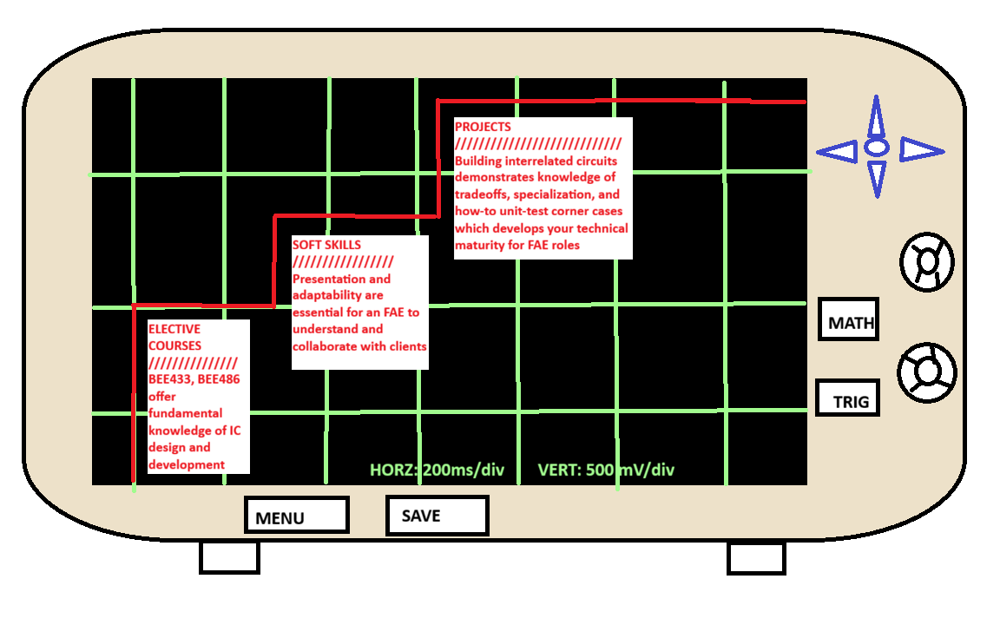

# Getting a Job as an IC Field Applications Engineer

## Table of Contents

- [Purpose](#purpose)
- [Best Practices](#best-practices)
    - [Best Practices Figure](#best-practices-figure)
    - [Upper-Division Electives to Take](#upper-division-electives-to-take)
         - [Electronic Circuit Design](#electronic-circuit-design)
         - [Fundamentals of IC Technology](#fundamentals-of-ic-technology)
    - [Personal Projects to Consider Building](#personal-projects-to-consider-building)
         - [Flash ADC](#flash-adc)
         - [SAR ADC](#sar-adc)
         - [Why Build Two Converters?](#why-build-two-converters?)
    - [Soft Skills](#soft-skills)
         - [Presentation](#presentation)
         - [Adaptability](#adaptability)
    - [Internships](#internships)
- [References](#references)
---
## Purpose
As a Husky EE student nearing graduation, you will soon begin applying for jobs. Your goal of becoming an integrated circuit field applications engineer is approaching fruition. The purpose of this document is to  give you a leap-start on how to best prepare for getting your dream-job.

## Best Practices
### Best Practices Figure
Best practices to get a job in IC FAE are discussed at length throughout the remaining document, and are summarized in the graphic below:

## Upper-Division Electives to Take
EE students take BEE 332 | Semiconductors & Devices II as a core requirement. After satiating this requirement, you should take particular electives to enhance your technical knowledge of integrated circuits. Recommended courses are listed below:

### Electronic Circuit Design
UWB offers BEE 433 | Electronic Circuit Design. In this class you gain an understanding of modern, solid-state design techniques for instrumentation purposes. The class focuses on design using integrated circuits (op-amps, processors, etc.) making it  invaluable to gaining familiarity with semiconductor technologies--products you will both sell and work alongside technical teams to implement.[^1]

### Fundamentals of IC Technology
UWB offers BEE 486 | Fundamentals of Integrated Circuit Technology. This course covers mircoelectronic processing technology, IC-material chemical processes, and teaches design considerations for transistors and other semiconductor components. You will want to take this class if understanding the "why" of component characteristics is on your horizon.[^1]

## Personal Projects to Consider Building
EE students with an array of technical projects prove their technical prowess by letting the projects section of their resume speak for them. Below are a couple inter-related project ideas to get you started:

### Flash ADC
A flash analog to digital converter is a circuit that takes an analog voltage and transforms it into a digital number; this is the way microphone software records audio and how battery voltages are converted to %s. This converter uses many comparators to compare the input signal to many references; this means the signal gets converted fast. Here is a tutorial on building a [Flash ADC project](https://www.youtube.com/watch?v=Q1I3axj1cQA, "DIY 3-bit Flash ADC").

### SAR ADC
A successive approximation register is a circuit that also takes an analog signal and returns a digital value. This circuit uses one comparator and binary search to find the correct value the signal should be converted to pointwise. Speed is moderate, but this tradeoff benefits power consumption and efficiency. Here is a [project schematic](https://hackaday.io/project/181826-homemade-successive-approximation-register-adc, "DIY SAR ADC"), and an associated [video demo](https://www.youtube.com/watch?v=lxwAKFijk50, "SAR ADC walkthrough")

### Why Build Two Converters?
The point of building different versions of the same circuit is  demonstrating an understanding of tradeoffs in circuit design. If your client want speed then what will you sacrifice? What is the best multi-terrain converter? This familiarity will help you show recruiters and hiring managers your ability to decide which component/integrated circuit is the right fit.

## Soft Skills
Soft skills like communication, time-management, and conflict resolution are ubiqitously desired qualities in any engineering role. The following soft skills are vital to your success as a Field Applications Engineer.

### Presentation
You are the face of the semiconductor-company you work for. Engineering teams at external companies collaborate with you to find optimal solutions to their problems. They will rely on your expertise and feedback to proceed with their projects. You must create a space where clients feel comfortable asking questions, and you must show your attention to detail in understanding their concerns. [^2]

The best practice to confirm that you understand someone's problem is to reflect it back to them in a different way and ask "Am I understanding this correctly?".[^2] i.e. if a client tells you their design problem then you can present a confifent understanding by drawing it out on a whiteboard, talking through the depiction, and asking if your visual captures their dilemna-- this accomplishes two things.

1.) You deeply understand the problem to fix and can easily communicate the needs of the client with your own team at the semiconductor company \

2.) You demonstrate an eagerness to understand and listen to the client.

### Adaptability
Talking to a panel of engineers can be a difficult conversation. Sometimes in order to solve a problem we need a different approach e.g. a frequency domain will provide a more fruitful analysis than time domain when analyzing AC circuits. As a Field Applications Engineer, you need to be able to find a natural flow in communicating with other-- an intuition on when to switch perspectives, and a sense of reading the satisfaction of the client's engineering team with the proposed solution. 

One unconventional way to gain this sixth sense is to take an improv class. Improv is hard because it forces you to think on your feet and teaches you to not get stuck in a recursive thought loop. Taking an improv class will certainly teach you to creatively adapt in demanding situations like interviews, sales pitches, and design meetings.

## Internships
Internships are a great way to demonstrate your ability to work on an engineering team with other people; they have become notoriously elusive and hard to get. You can land an internship by searching for companies in your field that are not being bombarded with applications. Bigger companies means more competition so your best bet is applying to companies with fewer applicants and making sure you stand out.

## References
[^1]: UW BOTHELL ENGINEERING AND MATHEMATICS (BOTHELL) ELECTRICAL ENGINEERING - UW BOTHELL COURSE OFFERINGS, \

            https://www.washington.edu/students/crscatb/bee.html (accessed Apr. 16, 2026). 
[^2]: A. Dennis and Z. Aljouni, “Student Informational Interview with Analog Devices Field Applications Engineer,” Apr. 16, 2026 
