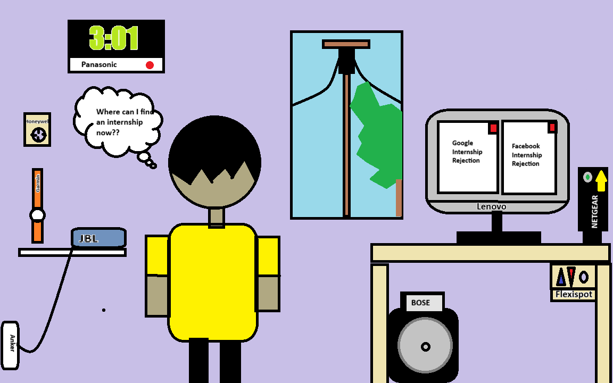

# Getting a Job as an IC Field Applications Engineer

## Table of Contents

- [Purpose](#purpose)
    - [Build Familiarity with IC Configurations Early](#build-familiarity-with-IC-configurations-early)
         - [Electronic Circuit Design](#electronic-circuit-design)
         - [Fundamentals of IC Technology](#fundamentals-of-ic-technology)
    - [Strengthen Skills Through Personal Projects](#Strengthen-Skills-Through-Personal-Projects)
         - [Flash ADC](#flash-adc)
         - [SAR ADC](#sar-adc)
         - [MOSFET Amplifier](#mosfet-amplifier)
         - [AM Radio Receiver](#am-radio-receiver)
    - [Build Customer Facing Engineering Skills](#build-customer-facing-engineering-skills)
         - [Create Understanding by Strengthening Presentation Skills](#create-understanding-by-strengthening-presentation-skills).
         - [Adapt to Thrive in Fast-Paced Engineering Environments](#adapt-to-thrive-in-fast-paced-engineering-environments)
    - [Sharpen Your Resume with Internship Experience](#sharpen-your-resume-with-internship-experience)
- [References](#references)
---
## Purpose
As a Husky EE student nearing graduation, you will soon begin applying for jobs. Your goal of becoming an integrated circuit field applications engineer is approaching fruition. The purpose of this document is to  give you a leap-start on how to best prepare for getting your dream-job.

## Build Familiarity with IC Configurations Early

**Why:**   Showing early understanding of foundational building blocks in IC design sets you apart to recruiters at semiconductor companies. Building an intuition of modular circuit configurations and IC fabrication techniques signals you already pocess valuable knowledge that will lessen company expenditures on training and onboarding making you the ideal canidate.

**How:**   Take these classes during your degree at UW Bothell.

### Electronic Circuit Design
BEE433 focuses on design using integrated circuits (op-amps, processors, etc.) making it  invaluable to gaining familiarity with semiconductor technologies--products you will both sell and work alongside technical teams to implement.[^1]

### Fundamentals of IC Technology
BEE 486 covers mircoelectronic processing technology, IC-fabrication chemical processes, and teaches design considerations for semiconductor components. A dedicated study will ensure you impress inteviewers in the technical interview.[^1]

## Strengthen Skills Through Personal Projects

**Why:** Technical interviewers want candidates with experience in design, testing, and troubleshooting. Building a portfolio of projects not only demonstrates your technical skills, but also gives you practical intuition about project development that you can draw on during interviews to stand out as a candidate.

**How:** Build projects you find interesting and then create a public GitHub repository to host them. Discuss the project and what you learned in a README file. Below are a couple ideas to get you started:

### Flash ADC
Circuit that takes an analog voltage and transforms it into a digital number.  Here is a [tutorial](https://www.youtube.com/watch?v=Q1I3axj1cQA, "DIY 3-bit Flash ADC") on building a flash ADC.

### SAR ADC
Circuit that also takes an analog signal and returns a digital value. . Here is a [project schematic](https://hackaday.io/project/181826-homemade-successive-approximation-register-adc, "DIY SAR ADC"), and a [video demo](https://www.youtube.com/watch?v=lxwAKFijk50, "SAR ADC walkthrough").

### MOSFET Amplifier
Circuit which uses a transistor to amplify a small signal. Try building one from this [project layout](https://www.electronics-tutorials.ws/amplifier/mosfet-amplifier.html).

### AM Radio Receiver
A device which can demodulate and play signals on AM frequency band. Here is a [guide](https://www.circuitbasics.com/what-are-am-radios/) to building one.

## Build Customer-Facing Engineering Skills
**Why:** Being an FAE necessitates clear explanation of technical solutions to a variety of customers with different design requirements so IC firms specifically look for students who depict strong presentation and adaptability skills.

### Create Understanding by Strengthening Presentation Skills

Presentation is about creating an atmosphere where you are listening and demonstrating understanding of the customer's technical deliverables and deadlines. This is often done by whiteboarding the technical issue in front of a panel of engineers from the client company and explicitly asking: "Am I understanding this correctly?".[^2]

Strengthen your presentation skills by taking a circuit from your class notes and explaining it on a whiteboard to a peer who will ask questions and give feedback. Do this exercise twice a month. This gives you practice explaining aloud and will allow you to reflect on which parts of your presentation need work.

### Adapt to Thrive In Fast-Paced Engineering Environments

An FAE may manage up to 20 different projects at once, so interviewers look for adaptable candidates who can communicate naturally and can shift perspective to create satisfaction and understanding during sales pitches and design meetings.[^2]

Augment your ability to communicate and switch perspectives early by taking an improv class. Taking an improv class teaches you to creatively adapt and not get stuck in a loop. Consider joining the [UW Collective Improv Troupe](https://huskylink.washington.edu/organization/improv) or take a class from [Unexpected Productions](https://www.unexpectedproductions.org/classes-2/).

## Sharpen Your Resume with Internship Experience
**Why:** Having any industry experience through an internship is an excellent way to show recruiters you have developed your soft skills and technical experience by working on a company project.

**How:** Make a list of companies outside of FAANG and apply to their internship programs 3 to 9 months before the quarter you hope to intern during. Make appointments with [UWB Career Services](https://www.uwb.edu/career-services/) to optimize your resume and cover letter for each application. 

 
 

##
WordCount: 665
## References
[^1]: UW BOTHELL ENGINEERING AND MATHEMATICS (BOTHELL) ELECTRICAL ENGINEERING - UW BOTHELL COURSE OFFERINGS, \

            https://www.washington.edu/students/crscatb/bee.html (accessed Apr. 16, 2026). 
[^2]: A. Dennis and Z. Aljouni, “Student Informational Interview with Analog Devices Field Applications Engineer,” Apr. 16, 2026 

